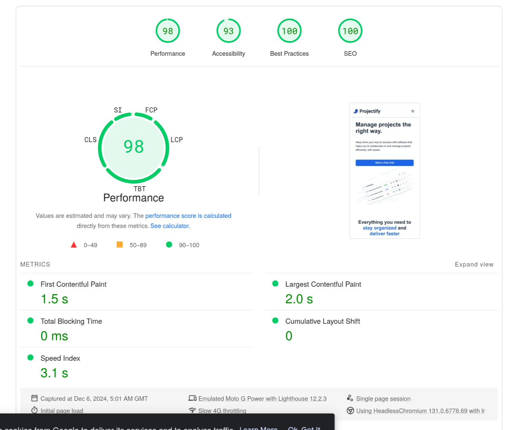
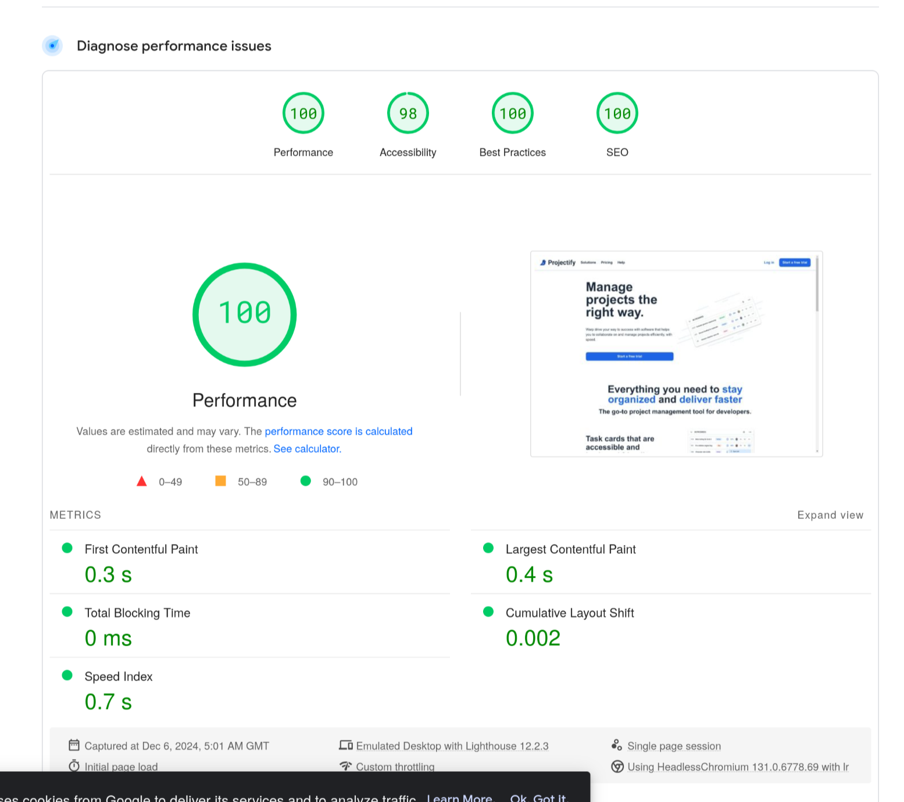
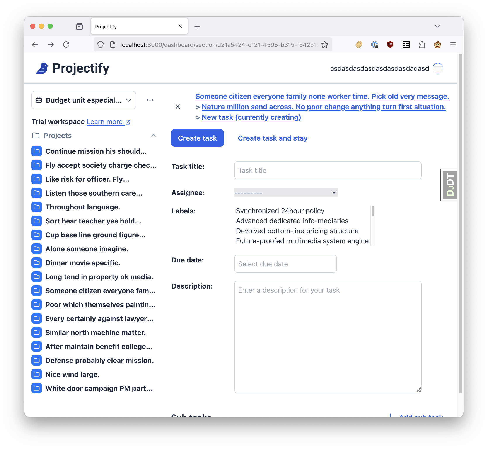

<!--
SPDX-FileCopyrightText: 2024 JWP Consulting GK

SPDX-License-Identifier: AGPL-3.0-or-later
-->

Here's is my work log for this project.

# 2024-11-25

I created a project detail view showing the sections and tasks in a project. It
was very easy to make using the Django `generic.detail.DetailView`. The
template naming is somewhat implicit, and the template is automatically picked
up from `workspace/project_detail.html` inside the
`projectify/workspace/templates` directory.

The URL is temporary for now:

```
workspace/project/<uuid>/view
```

It was pleasant to work with Django, there even is a debug toolbar which I have
added a long time ago for admin panel debugging.

# 2024-11-26

I would like to see if Tailwind works with Django. I'm following the
instructions here:

https://django-tailwind.readthedocs.io/en/latest/installation.html

Result: It is integrated into the backend flake build process (after a lot of
experimentation and various Nix path issues)

# 2024-11-27

I tested out `django-htmx`.

https://django-htmx.readthedocs.io/en/latest/installation.html

It was very easy to add.

There was an issue with tailwind not recognizing the templates. It was solved
by correcting the `contents` variable and give it the right glob to scan for
templates in Projectify. It was a bit confusing to correct since it uses a
relative path from within `projectify/theme/static_src`.

With `django-htmx` I now have sections where tasks can be moved up or down, and
only the contents of the section are replaced. Even better: It still works with
JavaScript turned off, in which case it moves tasks and then reloads the whole
page.

# 2024-11-29

Today I will try `django-components`:

https://github.com/EmilStenstrom/django-components

I find that a large part of frontend components props exist to configure
behavior, not style. It might be possible to re-implement components in the
backend and only add a few style props here and there. It might also be a good
opportunity to simplify the styling in general.

`django-components` seems very complex, and could almost be too much for our
purposes.

Let's consider for a second what the alternatives to migrating everything to
Django are:

## Keep SvelteKit and Django architecture

Doesn't change anything. Initial page loads are slow. Maintaining two different
applications is too much for a single developer.

## Migrate everything to be in SvelteKit

The Django ORM alone, and all the security stuff in it make Django worth it
even if just used for a backend. Using SvelteKit to take over the backend part
would not only mean having to re-implement well-tested business logic, it would
also mean compromising on security and quality.

## Migrate everything to a completely different framework/language/library

Why not re-implement everything and make it a slick single binary Go app? Sure,
but again, Django is incredibly powerful when it comes to database-centric
web-apps. Yes, I might also just use Rails or Laravel, but given that I haven't
used Rails in a long time, and don't know Laravel, these aren't good options
either. Go is a great programming language and the fact that it's so simple
would allow me to focus on the "important bits", like making an app that is
useful.

Re-implementing everything using something different means that the work
doubles, since both frontend and backend have to be rewritten. Rewriting the
frontend alone is already a lot of work, and more than that could be
devastating for motivation.

## Fix SSR in SvelteKit

> SvelteKit is a framework for rapidly developing robust, performant web
> applications using Svelte. If you’re coming from React, SvelteKit is similar
> to Next. If you’re coming from Vue, SvelteKit is similar to Nuxt.

I have tried to fix SSR by shifting around stores and so on to eliminate global
state. Yes, it's possible, but I feel like SvelteKit just hasn't been made to
guide you in the right direction and do those things properly from the
beginning. This makes me doubt that SvelteKit is a framework for making web
applications. A framework for making web applications should come with guard
rails that make accidentally embedding global state into your app difficult.

The **State management** [docs](https://svelte.dev/docs/kit/state-management)
were added quite late, and are not helpful after having made a full app. It
makes me question whether there won't be any other surprises.

There are other ideological points where I don't like SvelteKit's direction.
There is a subtle push to use VS Code to write SvelteKit, and despite the
complaints of many users, SvelteKit 1.0 uses square brackets and parentheses to
configure route paths.

The fact that the deploy documentation barely describes the self-hosted use
case also says a lot. I don't like being subtly pushed to using Vercel or
whatever other surprise-1000-USD charge service. Projectify is supposed to be a
self-hostable project management app. Creating all these proprietary lock-ins
doesn't help at all.

Backend/Frontend is an embarrassingly bad pattern for what is essentially a
skin for a database, a glorified excel spreadsheet with some authentication
sprinkled on top (I exaggerate, of course).

In the end all these ideological disagreements also strengthen my desire to
migrate away from SvelteKit. Making Projectify simple, even if that means
giving up a few features, is a net-positive for users and of course the solo
developer working on this project right now.

Django is quite mature, its documentation is translated into many languages,
and in general a good thing to use when trying to create something and opening
it up to the people.

If Projectify is supposed to be maintained for years to come, then going
through the painful process of a rewrite is a one-time thing, and everything
good after that will be a gift that keeps on giving.

# 2024-12-03

Today I will try `Alpine.js`.

https://alpinejs.dev/start-here

I copied the unified JavaScript file from
https://cdn.jsdelivr.net/npm/alpinejs@3.x.x/dist/cdn.min.js

Then, I've tried adding a label search that only renders when `Alpine.js` has
loaded using the docs at
https://alpinejs.dev/start-here#building-a-search-input

Using `:class`, I can make a search form that is only shown when Alpine loads.
See https://alpinejs.dev/directives/bind#class-object-syntax

Having interactive search is pretty nice, it might allow taking over the user
and label filter from the SPA.

## Identify remaining risks

Here are some of the remaining risks that I have identified over the last few
days of writing this document and experimenting with various libraries:

- Modal-less page flows might be very difficult to implement or decrease the
  usability a lot
- Adding too many backend and frontend libraries may cause the backend to bloat
  and return Projectify to the current bloated and slow state
- Any of the newly evaluated libraries might be abandoned or otherwise become
  unusuable for Projectify
- Porting components might be a gigantic time sinkhole

I will address each concern:

### Modal-less difficulties

Yep, a few pages have to be crafted for the constructive and destructive
modals. This will cause extra architecture, UX design, and coding work. This is
well worth it, since not only will it be pretty HTML with URLs as state, it
will most likely have better accessibility that Projectify's homebrew focus
trap that I've used before.

### Bloat

Yes, this is a real risk. Already, having added the tailwind and django
components library, Django has become a bit bloated.

I think it's not necessary to use a components library. I might just use
partials for everything. The settings are a bit non-intuitive and I've
encountered a strange error message that was difficult to debug:

```
  File "/.../django/__init__.py", line 24, in setup
    apps.populate(settings.INSTALLED_APPS)
  File "/.../django/apps/registry.py", line 124, in populate
    app_config.ready()
  File "/.../django_components/apps.py", line 24, in ready
    autodiscover()
  File "/.../django_components/autodiscovery.py", line 38, in autodiscover
    return _import_modules([entry.dot_path for entry in modules], map_module)
           ^^^^^^^^^^^^^^^^^^^^^^^^^^^^^^^^^^^^^^^^^^^^^^^^^^^^^^^^^^^^^^^^^^
  File "/.../django_components/autodiscovery.py", line 93, in _import_modules
    importlib.import_module(module_name)
  File "/.../importlib/__init__.py", line 126, in import_module
    return _bootstrap._gcd_import(name[level:], package, level)
           ^^^^^^^^^^^^^^^^^^^^^^^^^^^^^^^^^^^^^^^^^^^^^^^^^^^^
  File "<frozen importlib._bootstrap>", line 1204, in _gcd_import
  File "<frozen importlib._bootstrap>", line 1176, in _find_and_load
  File "<frozen importlib._bootstrap>", line 1140, in _find_and_load_unlocked
ModuleNotFoundError: No module named 'components'
```

The solution was to disable `autodiscover` for Django components.

The Django Tailwind integration on the other hand is well worth it. Adjusting
the Nix build was not very intuitive, but it works.

### Abandonware worries

Sometimes Django libraries get abandoned. This might happen with the Tailwind
integration used here, or the Django components. Tailwind itself will not
likely become abandonware, so it's not a big issue. I think I might even get
away just running Tailwind directly without any extras.

Alpine.js and HTMX might slow down in development at some point. The two
libraries are already extremely mature. I don't think abandonment is a big
issue to worry about with these widely used libraries. Both of them seem to
have stable funding as well.

### Time sinkhole

No one said it would be quick, but we're not in it to make a quick buck. I'd
like to create a rock-solid icebreaker, not a Rube Goldberg Machine that
constantly breaks because of 3rd order transient NPM dependencies. Also, this
thing is supposed to be a To Do list?

# 2024-12-06

Now I am determining the acceptance criteria.

## Functional requirements

Naturally, a regression in functionality shall be avoided at any cost, but not
realistic. Bugs will always sneak in, and the UI will change and the migration
will introduce new usability issues. Still, to set a minimum standard, we want
to ensure few things. I've added these to `docs/remove-fe.md`.

## Non-functional requirements

A performance degradation should be avoided.

The landing page was tested with PageSpeed Insights:

https://pagespeed.web.dev/analysis/https-www-projectifyapp-com/bhyke2wc99?form_factor=mobile

The following values were measures:

| Measurement    | Mobile | Browser |
| -------------- | ------ | ------- |
| Performance    | 98     | 100     |
| Accessibility  | 93     | 98      |
| Best Practices | 100    | 100     |
| SEO            | 100    | 100     |




These, of course, are measurements for the landing page.

Comparing this to Firefox running on my NixOS workstation, I see, for `/` the
following values in the network tab in a cache-less load:

- 84 requests
- 1.04 MB / 427.63 kB transferred
- Finish: 961 ms
- `DOMContentLoaded`: 390 ms
- `load`: 690 ms

With throttling set to "Good 3G", I see:

- 84 requests
- 1.08 MB / 405.88 kB transferred
- Finish: 2.52 ms
- `DOMContentLoaded`: 572 ms
- `load`: 1.57 s

These measurements should be interpreted with caution. PageSpeed Insights
emulates a "Moto G Power" with "Slow 4G throttling".

Furthermore, using Firefox's network tab, I measure a load from `/dashboard`,
which will always be slow since there is a long redirect chain to the actual
project happening.

- 87 requests
- 712.68kb / 319.08 kb transferred
- Finish: 2.79s
- `DOMContentLoaded`: 170 ms
- `load`: 170 ms

With throttling set to "Good 3G", I see:

- 86 requests
- 721.47 kB / 249.85 kB transferred
- Finish: 3.28 s
- `DOMContentLoaded`: 222 ms
- `load`: 222 ms

Based on the above values, some speed requirements were defined in
`docs/remove-fe.md`.

# 2024-12-09

I noticed that I haven't investigated adding widget templates for Django
forms. I also have to figure out how easy it is to reimplement the
more complex serializers as Django forms.

The widgets can be overwritten by creating templates in
`django/forms/templates`. Reference:

- https://docs.djangoproject.com/en/5.1/ref/forms/renderers/#djangotemplates
- https://github.com/django/django/tree/main/django/forms/templates/django/forms

The most complex serializer that Projectify has is the
`TaskCreateUpdateSerializer` in
`projectify/workspace/serializers/task_detail.py`. That thing is really, really
complex.

I've added a form for tasks. It was quite simple, including the related
fields. Next time I will work on the dynamic sub task creation.

## 2024-12-11

Todays' goal was to find out how to dynamically populate a form with extra
lines. The use case I have in mind is dynamic sub task creation when creating
tasks. Doing this with an SPA is straightforward in the beginning. Updating
tasks and not deleting sub tasks is a different challenge, of course.

The solution was to create a sub task formset view that renders the next
required Django `FormSet` item by passing back an `empty_form`. We also have
to keep track of how many sub tasks have been created. Luckily, HTMX has an
"out of band" insertion feature

https://htmx.org/docs/#oob_swaps

With this, we can append a new sub task after the existing sub tasks,
update the button that is used to request new sub task lines, and update a
hidden input field containing the total number of sub tasks. Does this work
without JavaScript enabled? Unfortunately not. But it was still extremely
straight forward to implement. A JS-less way of appending sub tasks would be
to have the user create the task first, and then add sub tasks while updating
the task.

We could of course have a very complicated mechanism here to re-render the task
creation page server-side when a new sub task is required. That would
definitely be more complicated to implement. And the fact that this works
without reloading the page is great.

## 2024-12-12

Today's goal is to figure out how to customize Django widgets. Reference:

https://docs.djangoproject.com/en/5.1/ref/forms/widgets/

This seems to be the template name for `TextInput`:

```
django/forms/widgets/text.html
```

I followed the advice from here:

https://docs.djangoproject.com/en/5.1/ref/forms/renderers/#django.forms.renderers.TemplatesSetting

I can now override Django widgets. Great.

## 2024-12-13

I've fully mocked up the task creation page:



## 2025-01-05

Happy new year.

I want to create the task update page as well in the prototyping phase
to make sure that the sub task diffing works well.

## 2025-01-06

Working on the task update page now. The goal is to make sure we have all
the functinoality needed to diff sub tasks updates. In the beginning, the
previous API had some issues with losing sub tasks when updating tasks.

## 2025-01-07

I've started working on the update task view. I also went back and fixed some
minor issues in the project view. One issue was that the table containing
each section's tasks had a `<tbody>` element that was preventing the grid
style from working. The browser inserts `<tbody>` where you don't add it
yourself in the HTML. Since I work with `display: contents`, I need to add
my own table body element with `display: contents` applied to it as well.

I've also spent some time on adding a Django template filter for formatting
percentages. I did this hoping that it would make percentages easier to
localize in the future.

The task update view lets you update basic task information. Sub tasks updates
are not possible yet. I want to break apart the remaining steps like so:

1. Make it possible to update existing sub tasks
2. Make it possible to delete existing sub tasks
3. Write code for changing order of existing sub tasks
4. Write code for adding new sub tasks at the end
5. Write code for changing order of new and existing sub tasks

Most of this work can then be re-used in the new task view.

## 2025-01-08

I've added the sub task formset rendering to the task update page. It's not
done yet. Some validation error seems to occur, so I want to render that
in the UI. This might be helpful:

https://docs.djangoproject.com/en/5.1/topics/forms/formsets/#using-a-formset-in-views-and-templates

I noticed that Django calls everything `object`, `form`, and `formset`. I want
to call things what they are instead. Gotta think on this one.

## 2025-01-09

Today I finished the formset -> sub task update conversion and make the
basic use case 1. "Make it possible to update existing sub tasks" work.

There are no error messages or anything right now.

I can use this

https://docs.djangoproject.com/en/5.1/topics/forms/#looping-over-the-form-s-fields

and make the template for the form a bit more maintainable. This is the way.

## 2025-01-11

I've now added a checkbox that lets you delete an existing sub task

# 2025-01-12

I realize that modifying forms can be done server-side as well. Here's the
use case: While adding or updating a task, I'd like to add a sub task.
Perhaps I've already entered a few sub tasks when editing an existing task.
Or I am adding a new task and I want to add my first sub task row.

The solution so far was the following: Since Projectify had a JavaScript
frontend, I could just manage the amount of sub tasks I want to add in the
frontend state. With Svelte, you'd use stores for this. The same applies to
ordering both new or existing sub tasks.

If I want to do this without a JavasScript frontend, I need to find other means
of managing the state of a task without having to store an intermediate
state of a task somewhere in the backend or database.

The solution is to submit a draft form to the server and let it know in the
POST request that this is a draft, not a final *save* request. A form can
have several *submit* buttons, not only one. If each submit button has a
different `name=` attribute, you can let the backend know which button was
pressed in the browser.

Let's say one of these buttons has the name `add-new-sub-task`. The POST
request will then let the backend know that this button has been pressed. The
backend then knows that this isn't a request to update a task based on the form
data. Instead, it will render a new form using all the task draft information,
with a new sub tasks row added at the end.

# 2025-01-15

Yesterday, I found a solution to make adding new sub task fields work. The
idea is to increase the total formset count by manually updating the POST
data. This is the relevant code:

```python
def view(request: HttpRequest) -> HttpResponse:
    post = request.POST.copy()
    sub_task_count_raw: str = post.get("form-" + TOTAL_FORM_COUNT, "0")
    try:
        sub_task_count = int(sub_task_count_raw)
    except ValueError as e:
        logger.error(
            "Unexpected error when getting total form count", exc_info=e
        )
        sub_task_count = 0
    post["form-TOTAL_FORMS"] = str(sub_task_count + 1)
    logger.info("Adding sub task")
    form = TaskUpdateForm(data=post, workspace=workspace)
    formset = TaskUpdateSubTaskForms(data=post)
    context = {"form": form, "task": task, "formset": formset}
    return render(request, "workspace/task_update.html", context)
```

Furthermore, I've decided to not implement sub task reordering. I question
the utility of sub task reordering in general, so I want to hold off on that
feature for now.
